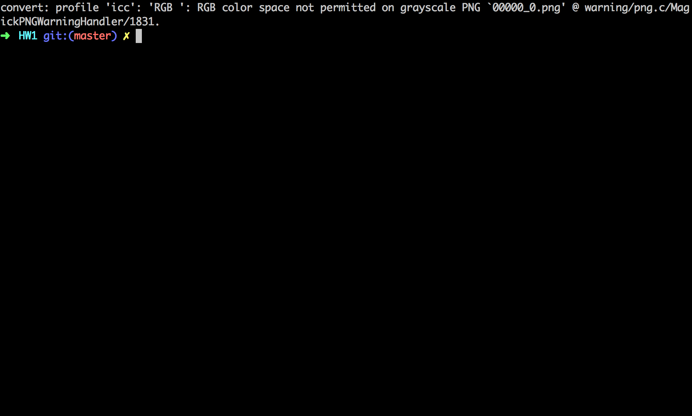

# Provisioning Servers(HW1)

## Amazon Web Service(AWS) RDS

Relational Database Service

Relational Database Service is a service provided by AWS. It is a managed database service(DBaaS). There are many challenges when managing a database servers. Database systems require the following features
- High uptime
- Scheduled backups 
- Database replaication
- Creating a cluster (master - master or master slaves) 
- Read replicas for proper load balacing. 
- Security updates 
- Database version upgrades.

Amazon RDS provides all these services out of the box. 

### Scale/Availibility/Performace 
One does not require a special Database Admin team to work on these services when using RDS. everything is available by a single click.
Like all the other AWS the biggest advantage is it is easy to scale. It provides APIs to which can scale up or down. Using the APIs (clients available in all languages) replication, backups, snapshots and other tasks can be easily scheduled and orchestrated.
It can be easily scaled vertically. Using the management console or API the database server can be increased in size(CPU/RAM) as per need.
RDS can be seen as MySQL on EC2, but it is customized for database systems. RDS provides (PIOPS) in order to achieve fasr, consistent I/O performance.

### Security
Amazon allows to encrypt the data store in the database using AWS key management Service. The application accessing the data doesnt need to be modified for encryption and decryption.

### Options
RDS provides options for MySQL, PostgresSQL, SQLServer Oracle as the underlying database system. Recently Amazone is coming up with Aurora, a MySQL compatible database as a service.
Under its DBaaS umberlla, Amazon provides DynamoDB which flexible NoSQL database as a service.

### Disadvantages
One does not have total access to the database machine(cannot ssh to database server)
It can get expensive when the data size increases.
It doesn not provide horizontal scaling. It can be done by sharding on the application level.

## API call to AWS

- Created an free account at AWS
- After the account was activated, I had access to the management web console. It was a dashboard of the the services provided by AWS(EC2, RDS, S3, etc)
- In the "Security Credentials" tab, under "Access Keys" I created the Access ket and Secret Key.
- I created an EC2 instance with generic settings and launched the instance.
- As I had the AccessKeys, using the Ruby client I __authenticated__ the client, then I called the "DescribeInstances" (https://ec2.amazonaws.com/?Action=DescribeInstances) API to get the details of my instances
- I printed the public_ip\_address, private\_ip_address, puclic DNS Name. Other details can also be printed.

## DEMO

